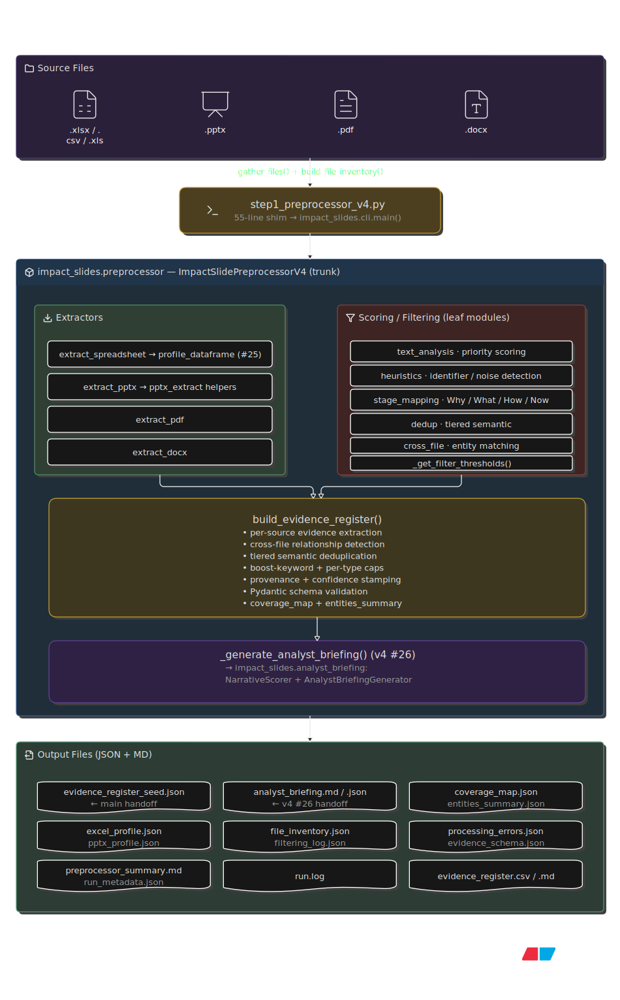

# Impact Slide Preprocessor — Step 1

This project ships **three versions** of the Step 1 preprocessor:

| Version | File | Status |
|---------|------|--------|
| **v4** | `step1_preprocessor_v4.py` (55-line shim → `impact_slides/` package) | **Active development — recommended.** Builds on v3 with the Analyst Briefing Generator (v4 #26): a Narrative Readiness Score (0–100 composite + per stage), ranked multi-signal Focus Areas, surfaced cross-file relationships, quality flags, and slide-building recommendations — emitted as `analyst_briefing.md` + `analyst_briefing.json` for a tighter handoff to the Impact Slide Analyst GPT. New `--focus-areas` flag + YAML `briefing` weights/keywords config (30 dedicated tests). **v4 is modularized** into the `impact_slides/` package (13 modules); `step1_preprocessor_v4.py` is a 55-line forwarding shim (PEP 562 `__getattr__`) so every existing `import step1_preprocessor_v4` + CLI invocation keeps working unchanged. |
| **v3** | `step1_preprocessor_v3.py` | **Stable baseline** (frozen regression net). Adds twelve insight-quality enhancements over v2 plus a Pydantic schema contract, richer PPTX extraction, merged pdfplumber/PyMuPDF table detection, fuzzy/abbreviation cross-file entity matching, tiered semantic dedup with source-merging, optional YAML config, always-on time profiling, centralized logging with run_metadata.json, configurable Why/What/How/Now stage mapping, and IQR outlier/correlation/period-trend analytics (199 dedicated tests). |
| **v2** | `step1_preprocessor_v2_full.py` | Stable, fully tested (201 tests). The bug-fix baseline. |

All three produce the same Evidence Register handoff for the Impact Slide
Analyst GPT; each version is a superset of the previous. **Use v4 going
forward** — it's modularized (each leaf module is single-read and independently
testable) and emits the strategic Analyst Briefing on top of the v3 register.
v3/v2 remain as frozen regression baselines.

> **Role in the Impact Slides workflow:** Step 1 — Python preprocessor.
> Ingests business source files (Excel, PowerPoint, PDF, Word) and produces a
> clean, **source-backed, priority-ordered Evidence Register** that the
> **Impact Slide Analyst GPT** (Step 2) treats as its source of truth when
> building a slide narrative around the *Why → What → How → Now* framework.

---

## Table of Contents
1. [Overview](#overview)
2. [Architecture](#architecture)
3. [The Processing Pipeline (what `run()` does)](#the-processing-pipeline-what-run-does)
4. [Functionality & Capabilities](#functionality--capabilities)
5. [Supported File Types](#supported-file-types)
6. [Outputs Produced](#outputs-produced)
7. [The Evidence Register](#outputs-produced)
8. [CLI Reference](#cli-reference)
9. [Installation & Dependencies](#installation--dependencies)
10. [Quick Start](#quick-start)
11. [Inspecting Insight Quality](#inspecting-insight-quality)
12. [Testing](#testing)
12. [Step 4 — Renderer v2](#step-4--renderer-v2-boardroom--grid-design-system)
13. [Schema Contract (Pydantic)](#schema-contract-pydantic)
13. [Design Notes & Quality Guardrails](#design-notes--quality-guardrails)

---

## Overview

This preprocessor is the **measurement and extraction layer** of the Impact
Slides hybrid workflow. Per the project's tool split, Python is responsible for
*extraction, measurement, validation, exact references, and chart data* — while
the GPTs handle *interpretation, storyline, and messaging*.

Given a folder of source files, it:
- inventories every file,
- profiles spreadsheets (numeric ranges, categorical distributions, dates),
- classifies and audits PPTX slides (charts, tables, bullets, notes),
- extracts text + tables from PDFs (with OCR fallback for scanned pages),
- extracts paragraphs/tables from DOCX,
- assembles everything into a single **priority-ranked Evidence Register**
  where every insight carries an `E####` ID, a source file, a source location,
  a priority score (0–1), a confidence level, and a `suggested_narrative_use`
  mapping to the Why/What/How/Now framework.

The Analyst GPT then *preserves those Evidence IDs* and only adds new ones when
clearly supported — so insights stay traceable from source file → slide.

---

## Architecture

v4 is modularized into the `impact_slides/` package (13 modules). The entry
point `step1_preprocessor_v4.py` is a 55-line forwarding shim (PEP 562
`__getattr__`) that delegates to `impact_slides.cli.main()`, which in turn
constructs the trunk class `ImpactSlidePreprocessorV4` from
`impact_slides.preprocessor`. Every leaf module is a small (<200 LOC) pure
module that fits in a single read and is unit-testable in isolation.



<details>
<summary>ASCII fallback (click to expand)</summary>

```
                ┌─────────────────────────────────────────────┐
   source files │  .xlsx .pptx .pdf .docx  (+.csv/.xls/.xlsm) │
                └──────────────────────┬──────────────────────┘
                                       │  gather_files() + build_file_inventory()
                                       ▼
  step1_preprocessor_v4.py  (55-line shim → impact_slides.cli.main)
                                       │
                                       ▼
                ┌─────────────────────────────────────────────┐
                │       impact_slides.preprocessor             │
                │       ImpactSlidePreprocessorV4  (trunk)     │
                │                                             │
                │  ┌─────────────┐  ┌──────────────────────┐  │
                │  │  EXTRACTORS │  │   SCORING / FILTERING│  │
                │  │ (trunk mthds│  │ (leaf modules)       │  │
                │  │  use leaves)│  │                      │  │
                │  │             │  │ text_analysis:        │  │
                │  │ extract_    │  │  priority scoring     │  │
                │  │  spreadsheet│  │ heuristics:           │  │
                │  │  → profile_ │  │  identifier/noise det │  │
                │  │    dataframe│  │ stage_mapping:        │  │
                │  │    → #25    │  │  Why/What/How/Now     │  │
                │  │    analytics│  │ dedup: tiered semantic│  │
                │  │ extract_pptx│  │ cross_file: entity    │  │
                │  │  → pptx_    │  │  matching             │  │
                │  │    extract  │  │ _get_filter_         │  │
                │  │    helpers  │  │  thresholds()        │  │
                │  │ extract_pdf │  └──────────┬───────────┘  │
                │  │ extract_docx│             │              │
                │  └──────┬──────┘             │              │
                │         │                    ▼              │
                │         ▼         ┌──────────────────────┐   │
                │  ┌────────────────▼────────────────────┐   │
                │  │     build_evidence_register()       │   │
                │  │  • per-source evidence extraction   │   │
                │  │  • cross-file relationship detection│   │
                │  │  • tiered semantic deduplication    │   │
                │  │  • boost-keyword + per-type caps    │   │
                │  │  • provenance + confidence stamping │   │
                │  │  • Pydantic schema validation       │   │
                │  │  • coverage_map + entities_summary  │   │
                │  └──────────────────┬────────────────────┘   │
                │                     │                        │
                │            v4 #26:  ▼                        │
                │  ┌──────────────────────────────────────┐   │
                │  │ _generate_analyst_briefing()         │   │
                │  │  → impact_slides.analyst_briefing:   │   │
                │  │    NarrativeScorer +                 │   │
                │  │    AnalystBriefingGenerator          │   │
                │  └──────────────────┬────────────────────┘   │
                └─────────────────────┼────────────────────────┘
                                      ▼
                ┌─────────────────────────────────────────────┐
                │            OUTPUT FILES (JSON + MD)         │
                │  evidence_register_seed.json  ← main handoff│
                │  analyst_briefing.md/.json    ← v4 #26 handoff│
                │  coverage_map.json  entities_summary.json   │
                │  excel_profile.json  pptx_profile.json       │
                │  file_inventory.json  filtering_log.json     │
                │  processing_errors.json  evidence_schema.json│
                │  preprocessor_summary.md  run_metadata.json  │
                │  run.log  (+ evidence_register.csv/.md)       │
                └─────────────────────────────────────────────┘
```

</details>

### Key components

| Component | Module | Responsibility |
|-----------|--------|----------------|
| `ImpactSlidePreprocessorV4` | `impact_slides.preprocessor` | Main orchestrator class. Holds config, runs the 5-step pipeline, owns all state. The deep methods (`run`, `build_evidence_register`, `extract_*`, `profile_dataframe`, `classify_slide`) live here — they're tightly coupled to `self.*` state, so they stayed on the trunk during the refactor. |
| `gather_files()` / `build_file_inventory()` | `preprocessor` | Recursively discover files; classify by extension; check readability. |
| `extract_spreadsheet()` → `profile_dataframe()` | `preprocessor` | Per-sheet profiling + v3 #25 analytics (IQR outliers, correlation, YoY/QoQ/MoM period trends). |
| `extract_pptx()` → `classify_slide()` | `preprocessor` + `pptx_extract` | Per-slide shape analysis (group recursion, SmartArt fallback, spatial ordering), classification into 17 slide types. |
| `extract_pdf()` + `_ensure_tesseract()` | `preprocessor` | PDF text + table extraction (pdfplumber/PyMuPDF merge) with OCR fallback. |
| `extract_docx()` | `preprocessor` | Word document paragraph + table extraction. |
| `build_evidence_register()` | `preprocessor` | Assembles, scores, sorts, deduplicates, boosts, validates all evidence. |
| `_find_cross_file_relationships()` | `preprocessor` (+ `cross_file` helpers) | Detects shared entities/values between Excel and PPTX via abbreviation expansion + fuzzy matching. |
| `_deduplicate_evidence()` | `preprocessor` (+ `dedup` engine) | Tiered semantic near-dup clustering (embeddings → fuzzy); source-merging provenance. |
| `_generate_analyst_briefing()` | `preprocessor` → `analyst_briefing` | v4 #26: builds the Narrative Readiness Score + ranked Focus Areas + quality flags + recommendations. |
| `_stages_for()` / `_build_stage_rules()` | `preprocessor` (+ `stage_mapping` tables) | v3 #24: configurable Why/What/How/Now stage assignment (3-layer rules table). |
| `clean_text`, `confidence_for_method`, … | `text_utils` / `heuristics` / `text_analysis` | Pure helpers used across the pipeline. |
| `get_logger()`, `git_commit()`, `git_dirty()` | `logging_setup` | v3 #23: centralized structlog/stdlib logger + read-only git provenance. |
| `load_config()` / `merge_config()` / `validate_config()` | `config` | v3 #21: YAML config resolution (CLI > YAML > default). |
| `main()` / `test_preprocessor()` / `inspect_register()` | `cli` | Argparse entry point + console helpers. |
| `EvidenceEntry` / `AnalystBriefing` / … | `schemas` | Pydantic contracts — single source of truth for output shapes; `--emit-schema` serializes them. |

### Optional dependencies (graceful degradation)

Every optional dependency is imported in a `try/except ImportError` block in
the module that needs it (no shared `deps.py` — that would re-couple what the
refactor decoupled). If a library is missing, the relevant feature degrades
cleanly instead of crashing:

| Dependency | Used by | Fallback when absent |
|---|---|---|
| `fitz` (PyMuPDF) / `pdfplumber` | `preprocessor.extract_pdf` | PDF extractor reports `"error"` status; rest of pipeline runs. |
| `python-docx` | `preprocessor.extract_docx` | DOCX extractor reports `"error"` status. |
| `pytesseract` + `Pillow` | `preprocessor._ensure_tesseract` | Scanned PDFs yield no text; `processing_errors.json` records a warning. |
| `pydantic` | `schemas`, `preprocessor._validate_evidence` | Runtime validation skipped (pipeline runs); `--emit-schema` unavailable. |
| `rapidfuzz` | `dedup`, `cross_file`, `analyst_briefing` | Falls back to stdlib `difflib` for char-similarity. |
| `numpy` | `dedup._tfidf_vectors`, `preprocessor` analytics | TF-IDF dedup tier unavailable; outlier/correlation math skips. |
| `sentence-transformers` | `dedup._load_sentence_model` | `auto` dedup falls back to rapidfuzz char-similarity. |
| `PyYAML` | `config.load_config` | `--config` errors clearly with a pip hint; pure-CLI usage unaffected. |
| `structlog` | `logging_setup.get_logger` | Falls back to stdlib `logging` via `_StdlibLogAdapter`; same kwarg API. |

---

## The Processing Pipeline (what `run()` does)

`run()` executes 5 logged steps:

```
[1/5] Discovered N files (M readable)
[2/5] Processing spreadsheet: <name>      → per-sheet profiling
[3/5] Processing PPTX / PDF / DOCX: <name>→ per-slide/page extraction
[4/5] Building Evidence Register ...
[5/5] Complete. Evidence entries: N
```

### Step 1 — File discovery & inventory
- `gather_files()` recursively lists all files under `--input` (skips dotfiles).
- `build_file_inventory()` classifies each by extension into `spreadsheet` /
  `pdf` / `docx` / `other` (PPTX falls under `other` and is detected by name),
  checks readability, and assigns a stable `F####` file ID.

### Step 2 — Spreadsheet profiling
For each Excel/CSV file, every sheet is read **header-less** and profiled by
`profile_dataframe()`:
1. **Header-row detection** (`_detect_header_row`): scores the first 15 rows to
   find the real header (favours text-heavy, distinct-value rows — fixes a bug
   where junk rows could beat real headers on ties).
2. **Column typing** per column: identifier, numeric, date, or categorical.
3. **Filtering** per `filter_level`: drops high-missing, generic-system
   (`created_at`, `is_active`, …), and high-cardinality-free-text columns.
4. **Findings** are emitted for numeric ranges (`Unit price 10.53–99.96`) and
   categorical distributions (`Branch has 3 unique values (C, A, B). Top 3
   account for 100.0%`) — each finding carries `location`, `column`, and a
   `priority_score`.
5. **Multi-column insights** suggest category-by-metric analyses.

### Step 3 — Document extraction (PPTX / PDF / DOCX)

**PPTX** (`extract_pptx` + `classify_slide`): for each slide it counts charts,
tables, pictures, shapes, connectors; extracts chart data (categories + series
values), table cells, bullets, bold/emphasized text, speaker notes, and theme
colors. `classify_slide()` then assigns one of 17 types — `title`, `agenda`,
`section`, `conclusion`, `data_chart`, `data_table`, `data_mixed`,
`diagram_process`, `comparison`, `quote_callout`, `content_insight`,
`content_light`, `low_value`, `thank_you`, … — each with a confidence and a
`priority_for_evidence` score.

**PDF** (`extract_pdf`): extracts the text layer per page via PyMuPDF. If
`--enable-ocr` is on and a page has <30 chars of text, it renders the page at
300 DPI and runs Tesseract OCR, keeping the longer text. Also extracts tables.
Each page is tagged `ocr_used: true/false`.

**DOCX** (`extract_docx`): extracts paragraphs and tables.

### Step 4 — Evidence Register assembly (`build_evidence_register`)
1. Walks every profile and converts findings/details into typed evidence
   entries (`numeric_range`, `chart_data_insight`, `table_cell`,
   `bullet_insight`, `speaker_notes_insight`, `pdf_page_insight`, etc.).
2. **Cross-file relationships** (`_find_cross_file_relationships`): detects
   shared entities (derived dynamically from Excel categorical values) and
   distinctive shared numbers (decimals or integers ≥100) between Excel and
   PPTX; caps matches to avoid flooding.
3. **Sorts** by `priority_score` descending.
4. **Deduplicates** (`_deduplicate_evidence`): near-identical texts (normalized,
   first 120 chars) collapse to the highest-priority version.
5. **Applies boost keywords** (`_apply_boost_rules`): evidence whose text
   contains a `--boost-keywords` term gets +0.15 priority (capped at 0.98).
6. **Applies legal-boilerplate downweight** (`_apply_downweight_rules`, v4):
   evidence whose text matches a built-in legal-boilerplate regex pattern
   (e.g. `"X" means`, `has the meaning set forth in Section N.N`, `Indemnification`,
   `Group Companies`, `hereby ... sells/assigns/transfers/conveys`) gets **−0.20**
   priority (floored at 0.05), stamped `downweighted_by_rule`. This is the
   inverse of `--boost-keywords` and stops M&A agreements / contracts from
   drowning out deal-relevance evidence (the `contains_insight_language()`
   heuristic is domain-blind and fires on `risk`/`key`/`important` in legal
   context). Ship-on-by-default with a `--no-downweight-boilerplate` escape
   hatch; `--downweight-keywords` extends the set for non-legal boilerplate.
7. **Caps per (source_file, insight_type)** (`_apply_per_type_caps`): high-volume
   prose types (`pdf_page_insight`/`pdf_ocr_page_insight` ≤40, `docx_insight` ≤30,
   plus the v3 caps for bullets/slides/table cells) so one large legal PDF or
   long DOCX cannot flood the register by sheer volume. Keeps the highest-
   priority representatives.

### Step 5 — Output (`_save_outputs`)
Writes all JSON outputs, the Markdown summary report, optional Markdown/CSV
exports, and (if `--inspect`) prints the console summary.

---

## Functionality & Capabilities

### Spreadsheet intelligence
- **Identifier detection** — `S.No`, `ID`, `Serial`, `Row`, `Key`, `Index`,
  `Number`, `Seq`, `UUID`, `GUID` by name; unnamed columns that form a
  contiguous `0..N` / `1..N` row index by value. A named business column that
  merely increments by 1 is **not** misfiltered as an ID.
- **System-column filtering** — `created_at`, `modified_by`, `is_active`,
  `has_flag`, `guid`, `uuid`, `hash`, `checksum`, …
- **Numeric profiling** — min/max/mean/median per numeric column.
- **Categorical profiling** — unique count, top-6 values with counts, top-3
  coverage % (correct for <3-value columns), actual value names included in
  the finding text (enables cross-file entity matching).
- **Date detection**, **header-row detection**, **multi-column suggestions**.
- **Configurable filtering** via 3 levels (see `--filter-level`).

### PPTX intelligence
- **17-way slide classification** with confidence + evidence priority.
- **Chart data extraction** — categories + per-series values, surfaced as
  `chart_data_insight` evidence.
- **Table cell extraction** — every cell scored; **noise cells** (IPs, URLs,
  user-agents, HTTP requests, log timestamps) are demoted so they don't
  outrank real insights.
- **Bullet capture** — both bulleted lines (`•`/`-`/`–`/`▪`/`*`) **and**
  substantive plain-text lines (≥4 words) so text-heavy decks are seeded.
- **Group-shape recursion** (v3) — nested textboxes inside groups are walked
  via `_iter_shapes_deep()`, so grouped content is no longer lost.
- **SmartArt / graphic-frame fallback** (v3) — when a shape has no `text_frame`
  (SmartArt, diagrams), `_extract_shape_text()` pulls text from the drawingml
  `<a:t>` runs in the shape's XML.
- **Embedded-object detection** (v3) — embedded/linked OLE objects (embedded
  Excel sheets, PDFs, …) are counted and listed in slide details
  (`embedded_objects`) so the Analyst knows unread signal exists.
- **Spatial shape ordering** (v3) — shapes are iterated in `(top, left)` order
  so multi-column slides concatenate in reading order, not insertion order.
- **Speaker notes**, **bold/emphasized text**, **theme colors**, **process
  steps** from diagram shapes.
- **Title-capture guard** — a leading numeric-only (page-number) textbox is no
  longer used as the slide title.

### PDF intelligence
- **Text-layer extraction** via PyMuPDF.
- **OCR fallback** for scanned pages via Tesseract (300 DPI).
- **Tesseract auto-detection** — honors `--tesseract-cmd`, then probes `PATH`
  and common Windows/Linux install locations; warns clearly if missing.
- **Merged table extraction** (v3) — `pdfplumber` (optional) is preferred for
  table cell detection because it handles ruled/unruled/merged/spanning tables
  better than PyMuPDF's default; PyMuPDF's `find_tables()` is the graceful
  fallback when pdfplumber is absent. Selectable via `--pdf-table-engine`
  (`auto`/`pdfplumber`/`pymupdf`). Each detected table now carries `header`,
  `cols`, `bbox`, and `engine`, and seeds per-cell `pdf_table_cell` evidence
  (pdfplumber-detected tables get `confidence=high`).
- **Correct `ocr_used` flagging** per page.

### Evidence register intelligence
- **Priority scoring** (0.0–1.0) per evidence, with insight-language boosting
  (keywords like *recommend, critical, growth, risk, record* raise priority).
- **Why → What → How → Now mapping** — every entry carries
  `suggested_narrative_use`; conclusion/recommendation bullets are tagged with
  `Now` (the call-to-action stage).
- **Cross-file relationships** — entity-based (dynamic, from Excel values) and
  distinctive-numeric, with **abbreviation/alias expansion** (US↔United States,
  EMEA↔expansion, YoY↔year-over-year, …), **word-boundary matching for all
  keyword lengths**, and **optional fuzzy matching** (rapidfuzz, difflib
  fallback) for near-spellings (Naypyitaw↔Naypyidaw). Per-entity
  **"mentioned in N files"** stats are tracked and surfaced in the cross-file
  evidence text + the coverage map's `entity_mentions` block.
- **Deduplication** (v3 #20: tiered semantic) — Pass 1 lexical (normalized
  first-120-chars) catches exact repeats; Pass 2 clusters near-duplicates via
  a **tiered semantic engine** selectable with `--dedup-engine`
  (`auto`/`embeddings`/`tfidf`/`fuzzy`). `auto` prefers **sentence-transformers
  embeddings** (the only tier that bridges synonyms / no-shared-vocabulary
  near-dups, e.g. "North America revenue grew 12%" ↔ "US & Canada sales up a
  tenth") and falls back to **rapidfuzz char-similarity** (catches lexical
  rephrasings like "Recommendation: expand" ↔ "Recommend expanding"). When a
  near-dup is dropped, its `source_file` + `evidence_id` are merged onto the
  surviving entry (`dedup_merged_sources` / `dedup_merged_ids`) so source
  provenance is preserved. **TF-IDF + cosine** is available as an explicit
  opt-in for prose-heavy registers, but empirical testing showed it over-merges
  templated evidence (distinct metrics sharing boilerplate + numeric values),
  so it is not the auto default. Plus **boost keywords**, **priority sort**.
- **Source-backing** — every entry traces to a real file + sheet/slide/page.
- **Time profiling (v3 #22)** — always-on (not verbose-gated). Every run prints
  a `[Timing]` summary to the console (total + per-stage: discovery,
  extraction, evidence-build, output) and a per-file breakdown sorted slowest-
  first. The same data is persisted to `preprocessor_summary.md` as a
  **Processing Time** section + per-file table, so you can see which file type
  dominates runtime. Uses `time.perf_counter()` (monotonic); per-file durations
  are independent deltas (not cumulative since run start).
- **Centralized logging + reproducibility (v3 #23)** — leveled logging
  (structlog preferred, stdlib fallback) replaces the ad-hoc `print()` pattern.
  Every run emits a timestamped `run.log` (full-fidelity DEBUG+) and an
  always-on `run_metadata.json` capturing preprocessor version, git commit +
  dirty flag, run timestamps, the resolved config snapshot (#21), per-stage
  timing (#22), the optional-deps inventory (which fallback tiers were active),
  and high-level counts — so any past run can be traced to its exact code +
  config + environment and reproduced. Git helpers are read-only (never
  commit/stage/push).
- **Configurable stage mapping (v3 #24)** — the Why→What→How→Now assignment
  is no longer hardcoded at ~20 evidence-creation sites. A centralized
  `stage_rules` table (3 layers: insight-type→stage, text-keyword→stage regex,
  slide-type→stage) drives all assignments, and users can override any layer
  via YAML config. Lookup order: keyword-override (first match) > insight-type
  default > fallback `What`. Validated against `NARRATIVE_STAGES` at config
  load (fail fast on bad stage names / bad regex).
- **Advanced analytics (v3 #25)** — three high-signal analytical passes that
  feed the What/How stages: (1) **IQR outlier detection** per numeric column
  (Q1−1.5×IQR / Q3+1.5×IQR bounds; emits `outlier_insight` with count, bounds,
  and example values); (2) **correlation hints** between numeric column pairs
  (Pearson r; emits `correlation_insight` when |r|≥0.6, priority scales with |r|,
  capped at 8 pairs); (3) **robust within-sheet YoY/QoQ/MoM period trends** —
  detects the period from a date column's span (YoY if >365 days, QoQ if >90,
  MoM otherwise), groups numeric metrics by period, and computes deltas
  (`period_trend_insight`). Much more robust than the cross-sheet sheet-name
  heuristic (#1) — works on a single sheet with a Date column.
- **Analyst Briefing Generator (v4 #26)** — a condensed strategic handoff for
  the Impact Slide Analyst GPT (Step 2). Emits `analyst_briefing.md` +
  `analyst_briefing.json` unconditionally, containing: (1) a **Narrative
  Readiness Score** (0–100 composite + per Why/What/How/Now stage) from a
  5-component weighted model (coverage balance 30%, priority quality 25%,
  cross-file connectivity 20%, recommendation strength 15%, signal ratio 10%);
  (2) **ranked Suggested Focus Areas** scored by a 5-factor model (avg
  priority + cross-file strength + insight-quality boost + source diversity +
  business-relevance signals) over multi-signal theme detection (column
  names, "X by Y" patterns, cross-file entities, business keywords, derived-
  insight boosts, near-duplicate theme merging); (3) the top cross-file
  relationships surfaced compactly; (4) quality flags
  (`missing_now_stage`, `no_cross_file_links`, `single_source`, …) and
  slide-building recommendations. Lives in `analyst_briefing.py` (decoupled,
  fully unit-testable); weights + business keywords overridable via YAML
  `briefing:` config; `--focus-areas N` CLI flag controls how many areas to
  surface. A `briefing` summary block is also added to `run_metadata.json`
  and a Narrative Readiness section to `preprocessor_summary.md`.

### Package layout

The full `impact_slides/` package tree and dependency layering are documented
in the **Architecture** section above (Key components table + the diagram).
In short: 13 modules, acyclic layering (leaves → `preprocessor` trunk →
`cli` → `step1_preprocessor_v4.py` shim). New code should import from the
package directly (`from impact_slides.preprocessor import ImpactSlidePreprocessorV4`);
the shim exists only for backward compatibility (the 430-test suite needed
zero edits).

---

## Supported File Types

| Extension(s) | Category | Handler | Notes |
|---------------|----------|---------|-------|
| `.xlsx` `.xls` `.xlsm` `.csv` | spreadsheet | `extract_spreadsheet` | pandas-based |
| `.pptx` | other (by name) | `extract_pptx` | python-pptx |
| `.pdf` | pdf | `extract_pdf` | PyMuPDF + optional Tesseract OCR |
| `.docx` `.doc` | docx | `extract_docx` | python-docx (`.doc` legacy limited) |
| other | other | — | inventoried but not deeply parsed |

---

## Outputs Produced

All written to `--output`. (The **Evidence Register** — the main Analyst handoff — is documented in detail at the end of this section.)

| File | When | Contents |
|------|------|----------|
| `file_inventory.json` | always | List of discovered files: `file_id`, `file_name`, `absolute_path`, `category`, `access_status`. |
| `excel_profile.json` | always | Per-file → per-sheet: numeric/categorical/date profiles, findings, multi-column insights, priority scores. |
| `pptx_profile.json` | if PPTX input | Per-file → per-slide: classification, visual counts, chart/table/bullet/notes details. |
| **`evidence_register_seed.json`** | if evidence found | **The main handoff to the Analyst GPT.** Priority-sorted list of evidence entries. |
| `coverage_map.json` | v3, if evidence found | Coverage summary: per Why/What/How/Now stage counts, stages with no evidence, per-source-file counts, avg priority. |
| `entities_summary.json` | v3, if Excel input | Top values per Excel categorical column with counts + share % — segmentation anchors for the Analyst. |
| **`analyst_briefing.md`** | **v4, always** | **The condensed strategic handoff to the Analyst GPT.** Narrative Readiness Score + components, per-stage sub-scores, ranked Suggested Focus Areas, top cross-file relationships, quality flags, slide-building recommendations. |
| `analyst_briefing.json` | v4, always | Structured version of `analyst_briefing.md` for agents/tooling. |
| `evidence_schema.json` | v3, if pydantic installed | The JSON Schema for an EvidenceEntry — the machine-readable contract the Analyst GPT can reference (generated via `EvidenceEntry.model_json_schema()`). |
| `filtering_log.json` | if items filtered | Why each column/insight was dropped (reason + thresholds) — useful for debugging. |
| `processing_errors.json` | if errors | Per-file error messages (e.g. missing Tesseract, unreadable file). |
| `preprocessor_summary.md` | always | Human-readable report: inventory, **Processing Time** (v3 #22), Excel/PPTX summaries, evidence breakdown, coverage map, **Narrative Readiness** (v4 #26), top-5, classification table. |
| `run.log` | v3, always | Timestamped, leveled log of every pipeline event (structlog/stdlib; full-fidelity DEBUG+). Machine-readable, so you can diff run N vs run N−1. |
| `run_metadata.json` | v3, always | **Reproducibility artifact:** preprocessor version, git commit + dirty flag, run timestamps, resolved config snapshot (#21), per-stage timing (#22), optional-deps inventory (which fallback tiers were active), high-level counts, **+ `briefing` block** (v4 #26: readiness score, stage scores, focus areas, quality flags). |
| `evidence_register.md` | `--export-md` | Evidence register as Markdown. |
| `evidence_register.csv` | `--export-csv` | Evidence register as CSV — full field set (v3): evidence_id, source_file, column_name, insight_type, semantic_type (v4), extraction_method, text, priority_score, confidence, suggested_narrative_use, source_location, ocr_used, related_files, boosted_by_rule, downweighted_by_rule (v4). |

### `evidence_register_seed.json` entry shape

```jsonc
{
  "evidence_id": "E0006",                 // unique, preserved by the Analyst GPT
  "source_file": "supermarket_sales.xlsx",
  "sheet_name": "January",                // or null for non-Excel
  "column_name": "Unit price",            // Excel-derived only
  "insight_type": "numeric_range",        // see "insight types" below
  "semantic_type": "Metric",            // v4: GPT-friendly bucket (Metric|Claim|Quote|Risk); see mapping below
  "extraction_method": "numeric_range",   // v3 #6: how derived (computed/chart_data/text_layer/ocr/bullet/table_cell/…)
  "text": "January: 'Unit price' ranges from 10.53 to 99.96.",
  "priority_score": 0.85,                 // 0.0–1.0, sorted descending
  "confidence": "high",                   // high | medium (v3 #9: keyed to extraction_method reliability)
  "suggested_narrative_use": ["What","How"], // subset of Why/What/How/Now
  "source_location": "January",           // sheet / "Slide N" / "Page N" / "Cross-file"
  "ocr_used": false                       // PDF pages only
}
```

### Evidence `insight_type` values
`numeric_range`, `categorical_distribution`, `multi_column_suggestion`,
`pptx_slide_insight`, `chart_insight`, `chart_data_insight`, `table_cell`,
`table_insight`, `text_metric`, `bullet_insight`, `process_step`,
`speaker_notes_insight`, `emphasized_text`, `section_divider`,
`pdf_page_insight`, `pdf_ocr_page_insight`, `pdf_table_insight`,
`docx_insight`, `cross_file_metric`.

### Evidence `semantic_type` (v4)

A GPT-friendly 4-bucket category assigned by the preprocessor alongside
`insight_type`, so the Analyst GPT can quickly weight evidence as a hard
number, a prose assertion, a verbatim quote, or a risk:

| `semantic_type` | insight_types that map to it |
|---|---|
| **Metric** | `numeric_range`, `categorical_distribution`, `aggregate_insight`, `trend_insight`, `period_trend_insight`, `outlier_insight`, `correlation_insight`, `chart_data_insight`, `chart_insight`, `text_metric`, `cross_file_metric`, `table_cell`, `table_insight`, `pdf_table_insight`, `pdf_table_cell` |
| **Claim** | `bullet_insight`, `pptx_slide_insight`, `pdf_page_insight`, `pdf_ocr_page_insight`, `docx_insight`, `process_step`, `section_divider`, `multi_column_suggestion` (the 3 structural types default to Claim — the safe catch-all) |
| **Quote** | `speaker_notes_insight`, `emphasized_text` (verbatim text) |
| **Risk** | never auto-assigned from `insight_type`; only via the **risk-keyword override layer** — evidence whose `text` matches a risk-language regex (`risk`, `exposure`, `volatility`, `headwind`, `vulnerable`, `downside`, `uncertain…`) is reclassified to `Risk` regardless of its `insight_type`. Extend the keyword set with `--semantic-type-keywords` / YAML `semantic_type_keywords`. |

The field is **optional in the schema** (default `None`) so the frozen v2/v3
regression baselines — which share `schemas.py` but predate the field — still
validate cleanly. The v4 chokepoint (`_validate_evidence()`) always populates
a real value before the register is written, so **every v4-generated register
carries `semantic_type`** (the only kind the Analyst GPT consumes). The GPT
preserves it like `evidence_id`.

**Lookup order (5 layers):**

1. **Risk keyword-override** (first regex match in `text`) → `Risk`, regardless
   of `insight_type`. Extend with `--semantic-type-keywords` / YAML
   `semantic_type_keywords`.
2. **Quote detection** (prose-scoped, `--semantic-detection`) → `Quote`.
   Attribution-gated quoted spans (a `"…"` of ≥8 chars followed by a speech
   verb / title / Person Name, OR colon-then-quote, OR a long ≥60-char quoted
   block). Scare quotes and short quoted words stay `Claim`. **Legal-definition
   guard**: the negative lookahead `"Term" means…` / `has the meaning set
   forth…` / `shall mean…` / `as defined…` excludes contract defined terms
   (EX-10.1 / 8-K filings) so they stay `Claim`, not `Quote`; the long-block
   heuristic also requires open→close curly-quote direction so the definition
   body between two consecutive defined terms doesn't match. Speech-verb /
   title alternations match case-insensitively; the Person-Name alternation
   `[A-Z][a-z]+\s+[A-Z][a-z]+` is case-sensitive so lowercase word pairs
   ("has the") don't masquerade as attribution.
3. **Metric detection** (prose-scoped, `--semantic-detection`) → `Metric`.
   Magnitude-gated: currency + magnitude (`$232M`, `€1.2 billion`), grouped
   thousands (`$700,000,000`), percentages (`23%`), or bare magnitude words
   (`28 million`). Plain small integers (`3 options`) and bare ranges
   (`10 to 99`) stay `Claim`.
4. **insight-type map** (the table above).
5. fallback `Claim`.

Layers 2 & 3 are **prose-scoped**: they only run on `bullet_insight`,
`pdf_page_insight`, `pdf_ocr_page_insight`, `docx_insight` (so an
`insight_type` already mapped to `Metric` like `numeric_range` is never
re-classified). `--semantic-detection {off,loose,default,strict}` controls
both: `default` (shipped ON, pptx excluded), `strict` (tighter regexes —
require attribution for quotes, KPI context for percentages), `loose` (adds
`pptx_slide_insight` + relaxed regexes), `off` (escape hatch — disables both,
Risk-override still applies). Precedence: a quoted risk statement → `Risk`
(layer 1 wins); a quoted number → `Quote` (layer 2 before 3).

---

## CLI Reference

```
python step1_preprocessor_v2_full.py --input <folder> --output <folder> [options]
```

Run with no `--input`/`--output` to execute the built-in smoke test.

### Core arguments

| Flag | Type | Default | Description |
|------|------|---------|-------------|
| `--input` | path | — | **Required.** Folder of source files (searched recursively). |
| `--output` | path | — | **Required.** Folder where outputs are written (created if missing). |
| `--filter-level` | choice | `conservative` | Filtering strictness. `conservative` = strict (min priority 0.25, ≥10% non-null, ≤90% unique); `moderate` = balanced (0.15 / 5% / 92%); `permissive` = minimal (0.05 / 2% / 98%). Lower levels retain more evidence. |
| `--focus-areas` | int | `5` | v4 #26: number of ranked Suggested Focus Areas to surface in the Analyst Briefing (`analyst_briefing.md`/`.json`). |
| `--max-text-length` | int | `800` | Maximum characters of the `text` field on every evidence entry (the `schemas.MAX_TEXT_LENGTH` ceiling). Applied uniformly at validation time so the register stays compact and the Analyst GPT token budget is predictable. Lower this (e.g. `500`) for a tighter budget; cannot exceed the schema ceiling (`800`). |
| `--semantic-type-keywords` | list | `[]` | v4: extra keywords (plain substrings, case-insensitive, word-boundary match) that reclassify matching evidence to `semantic_type="Risk"`. Extends the built-in risk-language set (`risk`/`exposure`/`volatility`/`headwind`/`vulnerable`/`downside`/`uncertain…`). Example: `--semantic-type-keywords churn breach compliance`. |
| `--semantic-detection` | choice | `default` | v4: controls two content-aware `semantic_type` layers (Quote then Metric) that run after the Risk keyword-override and before the insight-type map. `default` = prose-scoped (bullet/pdf/docx, excludes pptx); `strict` = same scope, tighter regexes; `loose` = adds `pptx_slide_insight` + relaxed regexes; `off` = disable both (escape hatch, Risk-override still applies). |
| `--downweight-keywords` | list | `[]` | v4: extra keywords that **downweight** matching evidence (lowers `priority_score` by 0.20, floored at 0.05). Plain substrings, case-insensitive, word-boundary match. **Extends** the built-in legal-boilerplate regex set (does not replace it) — use for non-legal boilerplate you want sunk in your corpus. Example: `--downweight-keywords hereby notwithstanding`. |
| `--no-downweight-boilerplate` | flag | off | v4: escape hatch — disable the built-in legal-boilerplate downweight patterns entirely (user `--downweight-keywords` still apply). Use for non-legal corpora where the built-in legal patterns (e.g. `"X" means`, `Section N.N`, `Indemnification`, `Group Companies`) would cause false-positive downweighting. |
| `--boost-keywords` | list | `[]` | Keywords that bump an evidence entry's priority by +0.15 (capped at 0.98), case-insensitive. Example: `--boost-keywords recommend critical growth`. **Mirror:** `--downweight-keywords` is the inverse (lowers by 0.20, floored at 0.05) for boilerplate suppression — see v4 legal-corpus scoring below. |
| `--verbose` | flag | off | Detailed console logging (boost keywords, export options, per-file timing, OCR errors). |

### OCR arguments

| Flag | Type | Default | Description |
|------|------|---------|-------------|
| `--enable-ocr` | flag | off | Enable OCR fallback for scanned PDFs. Without it, scanned pages yield no text. |
| `--tesseract-cmd` | path | auto | Path to the Tesseract binary. Auto-detected (`PATH` + common Windows/Linux locations) if omitted. |
| `--pdf-table-engine` | choice | `auto` | PDF table detection backend. `auto` = prefer pdfplumber, fall back to PyMuPDF; `pdfplumber`/`pymupdf` force a backend. |
| `--dedup-engine` | choice | `auto` | Semantic near-dup dedup engine. `auto` = prefer sentence-transformers embeddings, fall back to rapidfuzz char-similarity; `embeddings`/`tfidf`/`fuzzy` force a tier (graceful fallback). `tfidf` is opt-in for prose-heavy registers (over-merges templated evidence). |

### Export arguments

| Flag | Type | Default | Description |
|------|------|---------|-------------|
| `--export-md` | flag | off | Also write `evidence_register.md` (Markdown). |
| `--export-csv` | flag | off | Also write `evidence_register.csv`. |

### Inspection argument

| Flag | Type | Default | Description |
|------|------|---------|-------------|
| `--inspect` | flag | off | Print a readable top-N Evidence Register summary to the console after running. |
| `--inspect-top` | int | 15 | Number of top-priority entries to show with `--inspect`. |

### Schema argument (v3)

| Flag | Type | Default | Description |
|------|------|---------|-------------|
| `--emit-schema` | flag | off | Write `evidence_schema.json` (the Analyst GPT contract, generated from the Pydantic `EvidenceEntry` model) to `--output` and exit, without processing any files. Use this to refresh the schema you embed in the Analyst GPT prompt whenever the model changes. Requires pydantic. |

### Config argument (v3 #21)

| Flag | Type | Default | Description |
|------|------|---------|-------------|
| `--config` | path | none | Path to a **YAML config file**. Keys mirror the CLI flags in snake_case (`filter_level`, `dedup_engine`, `boost_keywords`, …). Precedence: **CLI flag > YAML value > argparse default**, so any flag passed on the command line overrides the file, and any key omitted from the file falls back to the built-in default. Requires PyYAML (`pip install pyyaml`); when absent, `--config` errors clearly and pure-CLI usage is unaffected. |

#### YAML config example

See [`config.example.yaml`](config.example.yaml) for a full template. A minimal one:

```yaml
input:  ./realworld_test/input
output: ./realworld_test/output
filter_level: permissive
dedup_engine: auto
boost_keywords: [recommend, critical, growth]
focus_areas: 5                  # v4 #26
# max_text_length: 800          # uniform evidence `text` cap (schema ceiling)
inspect: true
inspect_top: 20
```

Then run:
```bash
python step1_preprocessor_v4.py --config config.example.yaml
# CLI flags still override the file on a one-off basis:
python step1_preprocessor_v4.py --config config.example.yaml --inspect-top 5
```

#### YAML briefing config (v4 #26)

The Analyst Briefing (Narrative Readiness + Focus Areas) is configurable via
the optional `briefing:` key. Two sub-keys are accepted:

- `business_keywords: [a, b, c]` — extends the built-in keyword set used by
  theme detection (signal 4 of the multi-signal scorer).
- `readiness_weights:` / `focus_weights:` — override the 5-factor weight
  tables. Keys must match exactly (see below) and values must sum to **1.0**;
  a bad shape fails fast at `validate_config()`.

```yaml
briefing:
  business_keywords:
    - revenue
    - margin
    - adoption
  readiness_weights:           # keys must be exactly these, summing to 1.0
    coverage_balance: 0.30
    priority_quality: 0.25
    cross_file_connectivity: 0.20
    recommendation_strength: 0.15
    signal_ratio: 0.10
  focus_weights:               # keys must be exactly these, summing to 1.0
    avg_priority: 0.30
    cross_file_strength: 0.25
    insight_quality_boost: 0.20
    source_diversity: 0.15
    business_relevance_signals: 0.10
```

Omit any sub-key to use the built-in default for it. The weights are also the
documented contract for what the readiness score and focus-area score measure
(see **Analyst Briefing Generator (v4 #26)** in the Functionality section above).

---

## Installation & Dependencies

**Python 3.10+** (tested on 3.14).

```bash
python -m pip install pandas openpyxl python-pptx PyMuPDF python-docx Pillow pytesseract pydantic rapidfuzz pdfplumber numpy sentence-transformers pyyaml structlog
# Core deps (required): pandas openpyxl python-pptx PyMuPDF python-docx Pillow pytesseract
# v3 optional (graceful degradation if absent): pydantic rapidfuzz pdfplumber numpy sentence-transformers
```

| Package | Purpose |
|---------|---------|
| `pandas` + `openpyxl` | Excel/CSV profiling (required) |
| `python-pptx` | PPTX extraction (required for `.pptx`) |
| `PyMuPDF` (`fitz`) | PDF text/layout/OCR rendering (required for `.pdf`) |
| `pdfplumber` | Superior PDF table cell detection — ruled/unruled/merged tables (v3; optional — falls back to PyMuPDF's `find_tables()`) |
| `python-docx` | DOCX extraction (required for `.docx`) |
| `Pillow` + `pytesseract` | OCR for scanned PDFs (only needed with `--enable-ocr`) |
| `pydantic` | Schema contracts for the Evidence Register + JSON Schema generation (v3; optional — if absent, runtime validation is skipped but the pipeline runs) |
| `rapidfuzz` | Semantic near-dup dedup + cross-file fuzzy entity matching (#10, #17-19; optional — falls back to stdlib `difflib`) |
| `numpy` | Pure-numpy TF-IDF + cosine for the opt-in `tfidf` dedup tier (#20; optional — falls back to rapidfuzz/difflib) |
| `sentence-transformers` | Embedding-based semantic dedup — the only tier that bridges synonym / no-shared-vocab near-dups (#20; optional — `auto` falls back to rapidfuzz when absent) |
| `PyYAML` | `--config` YAML config file support (#21; optional — `--config` errors clearly when absent; pure-CLI usage unaffected) |
| `structlog` | Centralized leveled logging (#23; optional — falls back to stdlib `logging`; both write `run.log` + `run_metadata.json`) |

**External binary for OCR:** Tesseract OCR.
- **Windows:** `winget install UB-Mannheim.TesseractOCR` (lands in
  `C:\Program Files\Tesseract-OCR\`, auto-detected).
- **Linux:** `sudo apt install tesseract-ocr tesseract-ocr-eng`
  (auto-detected via `PATH` / `/usr/bin/tesseract`).
- Verify: `tesseract --version`.

Without Tesseract, the pipeline still runs; scanned PDFs simply yield no text
(and `processing_errors.json` records a clear warning).

---

## Quick Start

`step1_preprocessor_v4.py` is the active entry point. It's now a 55-line
forwarding shim that delegates to the modular `impact_slides/` package — so
every invocation style below works unchanged, whether you drive it from the
CLI, a YAML config, or a Python import. (v3/v2 baselines are also present if
you need the frozen regression versions; swap the filename.)

### 1. CLI with flags (most common)

```bash
python step1_preprocessor_v4.py \
  --input  ./source_files \
  --output ./output \
  --filter-level permissive \
  --focus-areas 4 \
  --export-csv \
  --boost-keywords revenue growth \
  --inspect --inspect-top 3
```

`--focus-areas N` is the v4 #26 flag: how many ranked Suggested Focus Areas
the Analyst Briefing surfaces (default 5). See the **CLI Reference** below for
the full flag list.

### 2. CLI with YAML config

```bash
python step1_preprocessor_v4.py --config config.yaml
```

Where `config.yaml` (keys mirror CLI flags in snake_case; see
`config.example.yaml` for the fully annotated template):

```yaml
# config.yaml
input: ./source_files
output: ./output
filter_level: permissive
focus_areas: 3
export_csv: true
briefing:
  business_keywords:     # extends the built-in set used for theme detection
    - revenue
    - margin
    - gross
  # Optional weight overrides (keys must match exactly + sum to 1.0):
  # readiness_weights:
  #   coverage_balance: 0.30
  #   priority_quality: 0.25
  #   cross_file_connectivity: 0.20
  #   recommendation_strength: 0.15
  #   signal_ratio: 0.10
```

**Precedence:** CLI flag (explicit) > YAML value > argparse default. So you
can mix — e.g. a YAML config with `filter_level: permissive` but override just
the output dir on the CLI:

```bash
python step1_preprocessor_v4.py --config config.yaml --output ./run_2026_07_04
```

A bad config (wrong keys, weights not summing to 1.0, bad enum value) fails
fast with `Config error: ...` and exits non-zero — it never silently falls back
to defaults against the wrong input folder.

### 3. Python import — CLI-tag style

For tests / scripting. The shim forwards the full namespace, so
`import step1_preprocessor_v4 as m` gives you the class, the helpers, the
tables, and the optional-dep flags:

```python
import step1_preprocessor_v4 as m   # the shim; forwards to impact_slides.*

p = m.ImpactSlidePreprocessorV4(
    input_path="./source_files",
    output_dir="./output",
    filter_level="permissive",
    boost_keywords=["revenue", "growth"],
)
# These attributes mirror the CLI flags:
p.focus_areas_count = 2          # --focus-areas 2
p.export_csv = True              # --export-csv
p.enable_ocr = False             # --enable-ocr off
p.dedup_engine = "auto"          # --dedup-engine auto
p.config_snapshot = dict(m.CONFIG_DEFAULTS)   # for run_metadata.json
p.stage_rules = p._build_stage_rules()        # apply any stage_rules overrides
p.run()

# m also exposes: main(), test_preprocessor(), inspect_register(),
# clean_text, _SemanticDedupEngine, git_commit, _HAS_PYDANTIC, etc.
```

**New code should prefer importing from the package directly** (the shim is
for backward compat, kept so the 430-test suite needed zero edits):
```python
from impact_slides.preprocessor import ImpactSlidePreprocessorV4
from impact_slides.cli import main
```

### 4. Python import — YAML-config style

For scripting when you want the same layered config resolution `main()` uses.
`load_config` / `merge_config` / `validate_config` / `CONFIG_DEFAULTS` all
forward to `impact_slides.config` through the shim:

```python
import step1_preprocessor_v4 as m

# 1. Load + resolve the YAML config (same path cli.main() takes)
yaml_cfg = m.load_config("config.yaml")          # {} if path is None; raises FileNotFoundError on typo
cfg = dict(m.CONFIG_DEFAULTS)
cfg.update(yaml_cfg)                             # YAML overrides defaults
cfg["input"], cfg["output"] = "./source_files", "./output"
m.validate_config(cfg)                           # fail-fast on bad values

# 2. Build the preprocessor from the resolved cfg (mirror cli.main)
p = m.ImpactSlidePreprocessorV4(
    input_path=cfg["input"],
    output_dir=cfg["output"],
    filter_level=cfg["filter_level"],
    boost_keywords=cfg["boost_keywords"],
)
p.focus_areas_count = cfg["focus_areas"]
p.export_csv = cfg["export_csv"]
br = cfg.get("briefing") or {}
p.briefing_readiness_weights = br.get("readiness_weights")
p.briefing_focus_weights = br.get("focus_weights")
p.briefing_business_keywords = br.get("business_keywords")
p.config_snapshot = dict(cfg)
p.stage_rules = p._build_stage_rules()
p.run()
```

> Note: the true CLI precedence (`_cli_was_set`) needs an argparse `parser` +
> `args` object. The pure-Python snippet above does a plain YAML-over-defaults
> merge; if you need exact CLI-tag precedence, call
> `m.main(["--config", "config.yaml", "--input", ..., "--output", ...])` instead —
> that runs the real `cli.main()` with full precedence resolution.

### What gets written

Every invocation writes the same output set to `--output`:

```
evidence_register_seed.json   <- the main handoff (priority-sorted)
analyst_briefing.md           <- v4 #26 strategic briefing (human+LLM)
analyst_briefing.json         <- v4 #26 structured briefing
coverage_map.json             <- Why/What/How/Now coverage
entities_summary.json         <- top values per Excel categorical column
excel_profile.json / pptx_profile.json   <- per-file extraction profiles
preprocessor_summary.md       <- human report (incl. Narrative Readiness section)
run_metadata.json             <- reproducibility (incl. briefing block)
run.log                       <- timestamped event log
evidence_register.csv         <- only with --export-csv / export_csv: true
evidence_schema.json          <- only with --emit-schema
```

**What to open first:** `output/preprocessor_summary.md` — the human-readable
overview (now includes a Narrative Readiness section). Then
`analyst_briefing.md` — the v4 strategic handoff. Then
`evidence_register_seed.json` — the Analyst GPT's raw material.

---

## Inspecting Insight Quality

The `--inspect` flag prints a quick console summary after a run:

- **Header** — total entry count + average priority.
- **Framework coverage** — which Why/What/How/Now stages have evidence, and
  which are missing (e.g. flags `Now` as missing when there's no
  conclusion/recommendation content).
- **Breakdown by source file** and **by insight type**.
- **Top-N evidence** — ID, priority, type, source location, narrative stages,
  text preview.
- **Quality flags** — automatically surfaces known anti-patterns:
  - noise (IPs/URLs/user-agents) ranking in the top 5,
  - numeric cross-file false positives flooding the register (>3 entries),
  - framework stages with zero evidence,
  - a high share of high-priority entries that are only "medium" confidence.

For automated validation of the register's structure against the Analyst's
contracts, see the test suite (next section).

---

## Testing

The test suite lives in `tests/` and uses `pytest`.

```bash
python -m pip install pytest pytest-mock
python -m pytest                 # full suite (~73s; 430 passed + 8 skipped = 438 collected)
python -m pytest tests/ -v       # verbose
python -m pytest -k ocr -v       # just OCR-regression tests
```

### Test modules

| File | Covers |
|------|--------|
| `conftest.py` | Shared fixtures: temp dir, Excel/PPTX/PDF builders, preprocessor factory. |
| `test_helpers.py` | Pure-function unit tests (clean_text, column letters, safe_stat, metrics, identifier/system/noise detection, priority scoring). |
| `test_classify_slide.py` | Table-driven classifier tests + the `diagram_score` crash regression. |
| `test_evidence_post.py` | Dedup, boost, cross-file relationships, filter thresholds, dynamic entity derivation. |
| `test_profiling.py` | `profile_dataframe` numeric/categorical/date/identifier behavior + `location`/`column` field fix + `top_3_pct` fix. |
| `test_pipeline.py` | End-to-end `run()`: Excel, PPTX (incl. section-slide crash regression), PDF, output contract, plain-text bullets, page-number-title fix. |
| `test_ocr.py` | `_ensure_tesseract` auto-detection + `extract_pdf` OCR path (skips if Tesseract absent). |
| `test_intent.py` | **Specification tests** verifying the codebase goal: source-backed, priority-ordered register mapped to Why→What→How→Now. |
| `test_realworld.py` | **Real-data regressions** using downloaded files (supermarket_sales.xlsx + Performance.pptx); skips if absent. |
| `test_v3.py` | **v3 enhancement regressions** — trends, cross-sheet consolidation, per-bullet ranking, coverage map, aggregates, provenance, CSV fields, per-type caps, confidence model, semantic dedup, nav-text filter, entities summary (synthetic + real-data). |
| `test_schemas.py` | **Pydantic contract tests** — `EvidenceEntry` accepts well-formed entries & rejects all malformed variants; runtime validation drops bad entries to errors; `--emit-schema` CLI; real register validates. |
| `test_pptx_extraction.py` | **v3 PPTX extraction regressions** — group-shape recursion, SmartArt/graphic-frame text fallback, embedded-OLE detection, spatial (top,left) multi-column ordering. |
| `test_pdf_tables.py` | **v3 merged PDF table extraction** — pdfplumber-preferred engine + PyMuPDF fallback, `--pdf-table-engine` flag, graceful degradation, enriched header/cols/cell evidence. |
| `test_cross_file_entities.py` | **v3 cross-file entity matching** — abbreviation/alias expansion, fuzzy matching + word-boundary for all lengths, per-entity "mentioned in N files" stats in evidence + coverage map. |
| `test_semantic_dedup.py` | **v3 tiered semantic dedup (#20)** — sentence-transformers embeddings tier (mocked), pure-numpy TF-IDF+cosine opt-in tier, rapidfuzz fuzzy fallback, source-provenance merging (`dedup_merged_sources`/`dedup_merged_ids`), graceful degradation, templated-data false-positive guard. |
| `test_yaml_config.py` | **v3 YAML config (#21)** — CLI>YAML>default precedence ladder, store-true overrides, boost-keyword lists, error paths (missing file, bad choice, bad type, non-mapping, no-PyYAML), end-to-end `main()` integration, pure-CLI regression. |
| `test_timing.py` | **v3 time profiling (#22)** — always-on console timing, per-file durations (not cumulative — the old bug), stage breakdown, PDF/DOCX timed, error-file status, persisted to `preprocessor_summary.md`, sorted per-file table. |
| `test_logging.py` | **v3 centralized logging + run_metadata.json (#23)** — structlog/stdlib logger factory with leveled console + run.log file, git provenance helpers (read-only), always-emitted run_metadata.json (version, commit, config snapshot, timing, optional-deps inventory, counts), error logging. |
| `test_stage_mapping.py` | **v3 configurable Why/What/How/Now stage mapping (#24)** — centralized stage-rules table replacing ~20 hardcoded literals, 3 config layers (insight_type, keyword-override, slide-type), `_stages_for()` lookup order, validation (bad stage/regex), regression guard. |
| `test_analytics.py` | **v3 IQR outlier detection, correlation hints, period trends (#25)** — IQR outlier bounds per numeric column, Pearson correlation between numeric pairs (|r|≥0.6), within-sheet YoY/QoQ/MoM trends via date-column period grouping, schema/stage registration. |
| `test_analyst_briefing.py` | **v4 Analyst Briefing Generator (#26)** — Narrative Readiness 5-component score + per-stage sub-scores, multi-signal Focus Area detection + near-duplicate merging + ranking, quality flags + slide-building recommendations, Markdown rendering, pipeline integration (artefact emission, run_metadata block, summary section, `--focus-areas` CLI, zero-evidence case). |
| `test_my_files.py` | **Template** to validate the preprocessor against *your own* files — set `MY_FILES` env var or edit `MY_FILES_DIR`, then run. |

### Running tests against your own files (`tests/test_my_files.py`)

This is a **template** that validates the preprocessor's output contracts
against *any* folder of your own source files — the same contracts the
Analyst GPT relies on. It builds a fresh Evidence Register from your files
and runs 8 checks:

| # | Test | What it validates |
|---|------|-------------------|
| 1 | `test_runs_without_error_and_emits_handoff_files` | `run()` doesn't crash; `file_inventory.json`, `evidence_register_seed.json`, `preprocessor_summary.md` all exist. |
| 2 | `test_register_is_nonempty_list` | The register is a non-empty JSON list (your files actually produced evidence). |
| 3 | `test_evidence_source_backed` | Every entry has a `source_file` and non-empty `source_location` (traceability). |
| 4 | `test_evidence_ids_unique_and_well_formed` | IDs are unique and match `E####` (the Analyst preserves these). |
| 5 | `test_register_priority_sorted` | Entries are sorted by `priority_score` descending. |
| 6 | `test_narrative_use_within_framework` | Every `suggested_narrative_use` is within `{Why, What, How, Now}`. |
| 7 | `test_no_numeric_cross_file_flooding` | No more than 3 numeric `cross_file_metric` entries (the bug-#11a false-positive guard). |
| 8 | `test_noise_not_at_top` | No IP/URL/user-agent noise in the top-5 entries (the bug-#11b guard). |

**Usage:**
```bash
# Point it at a folder of .xlsx/.pptx/.pdf/.docx files, one of two ways:
set MY_FILES=C:/path/to/your_files            # (a) env var
#   ...or edit MY_FILES_DIR at the top of tests/test_my_files.py  (b)

python -m pytest tests/test_my_files.py -v
```

It skips cleanly (all 8 tests skipped with a clear message) if the folder is
empty or missing, so the full suite stays green anywhere. It only activates
when `MY_FILES` points at real files. Note: it's a *structural/contract* test,
not a semantic correctness oracle — it confirms the register is well-formed
and the known anti-patterns don't recur, but can't judge whether your specific
insights are "right" (use `--inspect` for that manual review).

---

## v3 Enhancements (over v2)

`step1_preprocessor_v3.py` adds twelve insight-quality improvements, each pinned
by tests in `tests/test_v3.py`. Validated against the real-world files
(supermarket_sales.xlsx + Performance.pptx):

| # | Enhancement | Before (v2) | After (v3) |
|---|-------------|-------------|------------|
| 1 | **Trend insights across time-ordered sheets** — when sheets look time-ordered (month/quarter/year), per-column deltas are computed and emitted as `trend_insight` (What/How/Why, high priority). | 0 trend insights | **8** trends (e.g. "Total: decrease of 4.0% from January to March") |
| 2 | **Cross-sheet consolidation** — repeated per-sheet `numeric_range` entries for trended columns collapse to 1 representative + the trend. | 23 numeric_range (7 cols × 3 sheets) | **3** (only non-trend / representative) |
| 3 | **Per-bullet insight ranking** — individual bullets are scored by insight-language density via `insight_priority_boost()`, so "Recommendation: expand" outranks "LogLevel: …". | all 61 bullets flat at 0.75 | insight bullets boosted up to 0.94; generic stay at 0.75 |
| 4 | **Coverage map handoff** — a new `coverage_map.json` summarizes evidence per Why/What/How/Now stage and per source file, flagging stages with no evidence (e.g. `Now` empty). | no coverage signal | `coverage_map.json` + summary-report section |
| 5 | **Computed aggregate insights** — numeric×categorical group-bys are actually computed (not just suggested) and emitted as `aggregate_insight` with per-group totals. | 1 suggestion only | **18** concrete aggregates (e.g. "Unit price by Branch: A=6349, B=6544, C=6860") |
| 6 | **Extraction-method provenance** — every evidence carries an `extraction_method` (`computed`/`chart_data`/`text_layer`/`ocr`/`bullet`/`table_cell`/…) so the Analyst GPT can weight reliability. | no provenance | method on all entries |
| 7 | **Full-field CSV export** — `--export-csv` now writes the complete field set (source_file, column_name, extraction_method, ocr_used, related_files, boosted_by_rule) instead of 7 columns; lists are joined for CSV. | 7 CSV columns | **15** fields |
| 8 | **Per (source, type) caps** — bullet_insight ≤20, pptx_slide_insight ≤15, table_cell ≤12, categorical_distribution ≤12, so one source can't flood the register; highest-priority representatives kept. | unbounded (170 entries) | capped (94 entries, same signal density) |
| 9 | **Reliability-based confidence** — confidence is keyed to extraction method (computed/chart/numeric = high; OCR/bullet/table_cell = medium), downgrading over-confident entries. | arbitrary binary | method-driven |
| 10 | **Semantic near-dup dedup** — fuzzy similarity (rapidfuzz, difflib fallback) collapses rephrasings ("Recommendation: expand" ≈ "Recommend expanding") at threshold 0.85, while preserving genuinely distinct insights. | exact-prefix only | exact + semantic |
| 11 | **PPTX navigation-text filtering** — bullets duplicating the slide title or repeated across ≥30% of slides (footers/headers/section labels) are dropped; unique insights kept. | nav text leaked in | nav text filtered |
| 12 | **Top-entities summary** — a new `entities_summary.json` lists the top values per Excel categorical column with counts and share %, giving the Analyst ready-made segmentation anchors. | none | `entities_summary.json` (21 columns on the real file) |

New module-level helpers: `sheet_time_rank()`, `insight_priority_boost()`,
`_parse_numeric_token()`, `confidence_for_method()`, `_text_similarity()`,
`_iter_shapes_deep()`, `_extract_shape_text()`, `_is_group()`,
`_is_embedded_object()`, `_shape_position()`. New evidence types: `trend_insight`,
`aggregate_insight`. New output files: `coverage_map.json`, `entities_summary.json`.

---


## Step 4 — Renderer v2 (Boardroom + Grid Design System)

After Builder JSON is approved, paint a deterministic 1920×1080 HTML deck:

```bash
python -m impact_slides.renderer_v2   --handoff path/to/builder_handoff.json   --seed path/to/evidence_register_seed.json   --out path/to/out_dir

# thin shim
python step4_renderer_v2.py --handoff ... --out ...
```

**Delivery modes.** Default is **self-contained**: Boardroom webfonts
(Source Sans 3, IBM Plex Sans) are embedded as `@font-face` data URLs from
vendored WOFF2 files (`impact_slides/renderer_v2/assets/fonts/`), and the deck
opens fully offline / VPN-safe. `--use-cdn` is a **development-only** escape
hatch that references Google Fonts via CDN — never ship CDN-mode decks to
customers. The two flags are mutually exclusive; strict validation fails any
remote fetch URL in self-contained output. Third-party inventory lives in
`impact_slides/renderer_v2/assets/THIRD_PARTY.md`; engineering detail in
`wiki/SPEC_renderer_v2_p0_self_contained.md` (MVP cut:
`wiki/SCOPE_renderer_v2_mvp1.md`).

| Output | Description |
|--------|-------------|
| `presentation.html` | Self-contained Boardroom deck (`gl-*` Grid primitives) |
| `slide_notes.md` | Presenter-deliverable prose notes |
| `evidence_manifest.json` | Slide→evidence map (`style_preset: BoardroomEarnings`) |
| `run_meta.json` | Generator version + layout inventory + `delivery` + `features_enabled` + `html_bytes` |

**Feature gating.** Optional JS capabilities are **auto-enabled from the handoff**
(e.g. chart layouts → `charts`). Reserved ids: `charts`, `mermaid`, `alpine`,
`swiper`, `icons`. Override with `--force-feature ID` / `--suppress-feature ID`
(suppress beats force beats detect; unknown ids fail closed). Enabling a feature
in MVP1 may be **metadata-only** until that library is vendored (Chart.js lands
in P3). See `wiki/SPEC_renderer_v2_p1_feature_size_gating.md`.

**Size.** Every run records `html_bytes` on `run_meta.json`. Crossing the
advisory threshold (~2 MiB) prints a **soft warning** on stderr and does **not**
fail the run. Baseline mini fixture is ~180 KB with `charts` suppressed; ~385 KB with
Chart.js inlined (measured self-contained).

**Design tokens.** Boardroom brand + curated Open Props–*inspired* primitive
scales are **always on** (not feature-gated). Single owner doc:
`wiki/SPEC_renderer_v2_tokens_owner.md`. Prefer `render_deck(..., theme={})`
semantic keys for light rebrands — do not fork layout CSS.

**Charts (P3).** When `charts` is auto-enabled (or forced), **Chart.js 4.4.8**
is inlined for **grouped bar**, **line**, and **combo** layouts. Suppressing
`charts` falls back to the existing SVG painters. stacked / waterfall /
heatmap / icon_grid stay on the SVG/pack path. Animation defaults off.
Spec: `wiki/SPEC_renderer_v2_p3_chartjs.md`. Pin: `assets/libs/chart.umd.min.js`.

**Native disclosure (P5).** Additive handoff field `disclosure` (also under
`content` / `visual_spec`) expands to HTML/CSS-only patterns — no Alpine:
`detail` (`<details>`), `accordion` (multi-open details), `tabs` (radio CSS).
Example: `{"pattern":"detail","panels":[{"title":"Methodology","body":"…"}]}`.
Unknown patterns fail closed. Spec: `wiki/SPEC_renderer_v2_p5_native_disclosure.md`.
Fixture: `tests/fixtures/renderer_v2/disclosure_handoff.json`.

**Layout mapping** uses shared CSS under `impact_slides/renderer_v2/css/`
(`tokens`, `viewport`, `gridlines`, `components`) rather than ad-hoc per-layout
grids. Optional freeform: `visual_spec.grid` named slots (see Builder prompt).

**Relation to other Step 4 paths:**
- **Copilot/ChatGPT** Impact Slide Renderer prompt — LLM hand-author path for the same Boardroom contracts.
- **`step4_builder_validator.py`** — older PPTX/HTML fallback; does not yet paint charts/freeform boardroom physics fully.

Flags: `--self-contained` (default) embeds required assets; `--use-cdn` references them via CDN (dev only); `--force-feature` / `--suppress-feature` override auto-detected feature ids; `--debug` outlines `gl-*` regions; default validation rejects face `E####`, missing Boardroom tokens, remote fetches in self-contained decks, or broken stage JS (`--no-strict` to warn only).


## Schema Contract (Pydantic)

The shape of the Evidence Register — the contract the Impact Slide Analyst GPT
treats as its source of truth — is formally defined in **`schemas.py`** as
Pydantic `BaseModel` classes. This makes it a single source of truth instead
of three loose places (README prose, dict-building code, GPT-prompt text) that
can drift apart.

**What this gives you:**

1. **Runtime validation** — before the register is written, every entry is
   validated against `EvidenceEntry`. Malformed entries (bad `evidence_id`,
   out-of-range `priority_score`, unknown `insight_type`, non-framework
   narrative stage, …) are dropped to `processing_errors.json` instead of
   silently shipping bad data to the GPT.
2. **A machine-readable GPT contract** — `EvidenceEntry.model_json_schema()` is
   auto-generated as `evidence_schema.json` on every run (and via
   `--emit-schema`). Paste that JSON Schema straight into the Analyst GPT
   prompt instead of a fragile prose description; refresh it whenever the model
   changes.
3. **One-place schema evolution** — when v4 adds a field or evidence type,
   change `schemas.py` and the README, code, JSON output, and GPT contract all
   stay in sync because they derive from it.

The models: `EvidenceEntry` (the core contract), `FileInventoryItem`,
`CoverageMap`, `EntitiesSummaryItem`. Constrained fields: `evidence_id`
(matches `E\d{4}`), `priority_score` (0.0–1.0), `insight_type` &
`extraction_method` & `confidence` (enum sets), `suggested_narrative_use`
(subset of Why/What/How/Now). Extra optional fields (`related_files`,
`boosted_by_rule`, `pptx_classification`, `group_by`, `metric_value`,
`metric_type`, `table_cell`) pass through unchanged.

Pydantic is optional at runtime: if it's not installed, the pipeline still
runs (validation is skipped), but `evidence_schema.json` won't be emitted.
Install it with `pip install pydantic`.

---


These are the bugs and anti-patterns found during testing and the guardrails
now in place (each pinned by a regression test):

- **OCR flag plumbing** — `--enable-ocr` actually flows through `run()` to
  `extract_pdf`; Tesseract is auto-located; `ocr_used` reflects real OCR.
- **Classifier crash fix** — `classify_slide` no longer raises
  `UnboundLocalError` on section-divider titles (the whole PPTX was silently
  marked as error before).
- **Excel traceability** — findings carry `location` + `column`, so Excel
  evidence has non-empty `source_location`/`column_name`.
- **"Now" framework stage** — conclusion/recommendation/next-step bullets are
  tagged with `Now` (previously the framework's call-to-action stage had no
  evidence feeding it).
- **Cross-file entity derivation** — entity candidates come from the Excel's
  actual categorical values (not a hardcoded 7-word list), with word-boundary
  matching for short keywords.
- **Cross-file numeric false positives** — only distinctive numbers (decimals
  or integers ≥100) match, and matches are capped at 3.
- **Table-cell noise** — IP/URL/user-agent/HTTP/log-timestamp cells are
  demoted below real insights.
- **`top_3_pct` correctness** — columns with <3 unique values report real
  coverage (100.0%, not 0.0%).
- **Text-heavy decks** — plain-text lines (not just bulleted ones) are seeded
  as bullet insights.
- **Page-number-as-title** — a leading numeric-only textbox is skipped as a
  title candidate.
- **Identifier heuristic** — a real metric that increments by exactly 1 is not
  misfiltered as an ID (only unnamed contiguous `0..N`/`1..N` indices are).
- **Header-row ties** — real headers (distinct values) beat junk rows on ties.

See `tests/README.md` for the full bug-fix regression index and
`realworld_test/INSIGHT_QUALITY_ASSESSMENT.md` for the real-world quality study.
